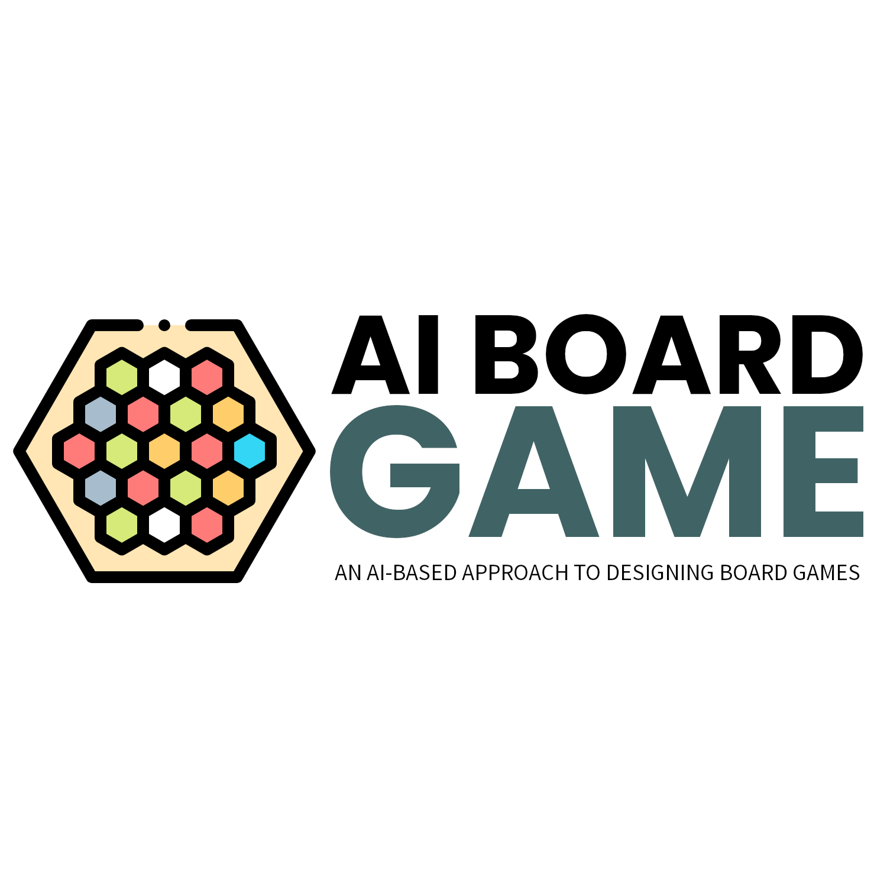
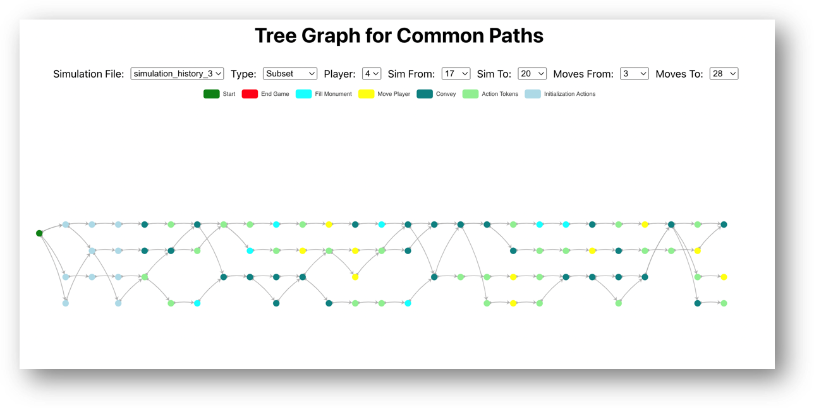

# An AI-based Approach to Designing Board Games

<!-- PROJECT LOGO -->
 

  

  <h3 align="center">An AI Based Approach to Designing Board Games</h3>

## About The Project

<i>This project was developer for McMaster Software Engineering Final Year Capstone.</i>

Designing a board game is a tedious process, one aspect that can be improved is in the testing phase. Instead of paying humans to manually test a game, we've created a system that uses AI to simulate thousands of games to expedite this process.

### Built With

The AI system is built with Python and uses <a href="https://tianshou.readthedocs.io/en/master/">Tianshou</a></li>, <a href="https://gymnasium.farama.org/">Gymnasium</a></li> and <a href="https://pettingzoo.farama.org/">PettingZoo</a></li> for multi-agent reinforcement learning. The Data visualizer is built with React and <a href="https://echarts.apache.org/en/index.html">Apache ECharts</a></li>

- [![Python][Python]][Python-url]
- [![React][React.js]][React-url]

<!-- GETTING STARTED -->

## Getting Started

This is an example of how you may give instructions on setting up your project locally.
To get a local copy up and running follow these simple example steps.

### Installation and Usage

Installation instructions for the AI System can be found <a href="https://github.com/michaelilao/aiboardgame/blob/main/src/AnAgeContrived/README.md">here</a>

Installation instructions for the Data Visualizer can be found <a href="https://github.com/michaelilao/aiboardgame/blob/main/src/visualization_v1/README.md">here</a>

## Examples

Example graph of the data visualizer that shows common paths an AI Agent made during a simulation

## Acknowledgments

Developer Names: <a href="https://github.com/michaelilao">Michael Ilao</a>, <a href="https://github.com/EngandDeveloper">Jonah Ada</a>, <a href="https://github.com/Hargun22">Hargun Bedi</a>, <a href="https://github.com/Dorps">Jeffrey Dang</a> and <a href="https://github.com/Martin-Mai">Tianzheng Mai</a>

Supervisors: <a href="https://mosser.github.io/">Dr. Sébastien Mosser</a> and <a href="https://cbe.uqam.ca/">Dr. Vladimir Reinharz</a>

<!-- MARKDOWN LINKS & IMAGES -->
<!-- https://www.markdownguide.org/basic-syntax/#reference-style-links -->

[Python]: https://img.shields.io/badge/Python-3776AB?style=for-the-badge&logo=python&logoColor=white
[Python-url]: https://www.python.org/
[React.js]: https://img.shields.io/badge/React-20232A?style=for-the-badge&logo=react&logoColor=61DAFB
[React-url]: https://reactjs.org/
